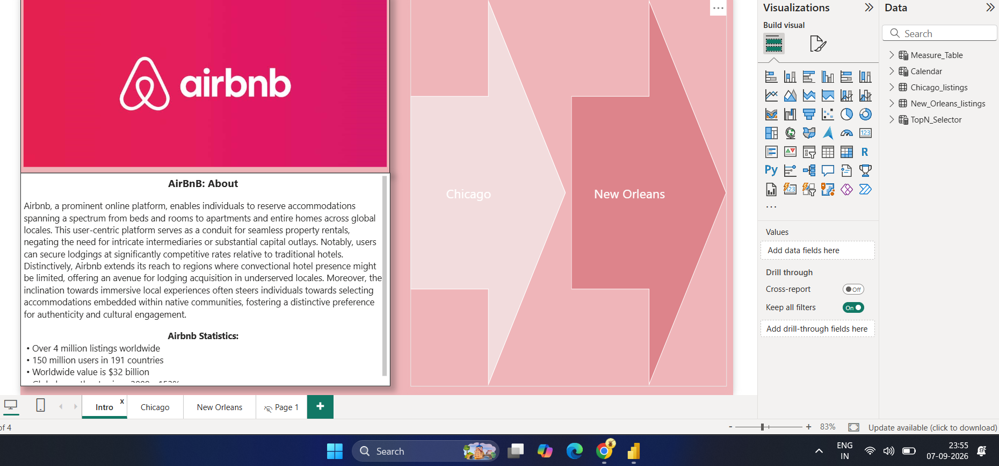
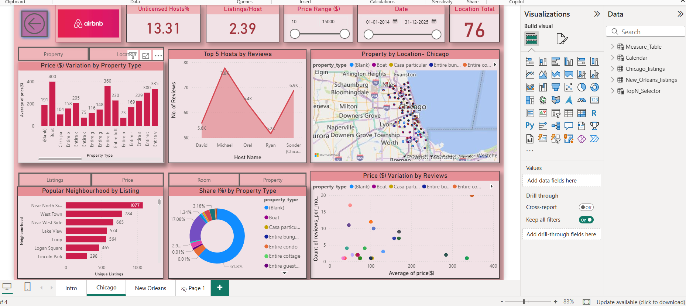
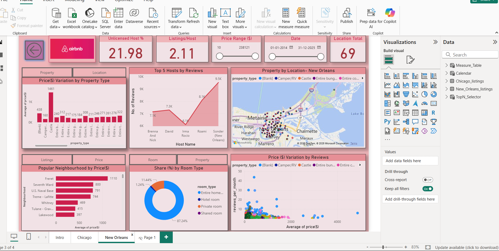

# 🏠 Airbnb Listings Dashboard – Chicago vs New Orleans

## 📌 Project Overview

This project presents an interactive **Power BI dashboard** that analyzes and compares Airbnb listings across **Chicago and New Orleans**.

The dashboard focuses on **listing distribution, pricing, host behavior, property types, room types, reviews, and neighborhood-level patterns** to turn raw Airbnb data into meaningful insights.

The project demonstrates practical skills in **data cleaning, data modeling, DAX, KPI analysis, and interactive data visualization using Power BI**.

---

## 🎯 Objectives

- Compare Airbnb listings between Chicago and New Orleans
- Analyze pricing patterns across both cities
- Understand host and listing behavior
- Identify neighborhood-level patterns
- Analyze property and room-type distribution
- Compare listing and pricing patterns
- Create interactive KPIs and visualizations using Power BI
- Present data in a clear and business-friendly format

---

## 📊 Dataset Overview

The analysis covers **16,590 Airbnb listings** across Chicago and New Orleans.

| Metric | Value |
|---|---:|
| Total Listings | 16,590 |
| Chicago Listings | 8,748 |
| New Orleans Listings | 7,842 |
| Neighborhoods | 144 |
| Unique Hosts | 7,367 |

---

# 📷 Dashboard Preview

## 🏠 Introduction

The introduction page provides an overview of Airbnb and the purpose of the Chicago vs New Orleans analysis.



---

## 🌆 Chicago Dashboard

The Chicago dashboard provides an interactive analysis of:

- Listings
- Pricing
- Hosts
- Property types
- Room types
- Neighborhoods
- Reviews
- Geographic distribution



---

## 🎺 New Orleans Dashboard

The New Orleans dashboard provides an interactive analysis of:

- Listings
- Pricing
- Hosts
- Property types
- Room types
- Neighborhoods
- Reviews
- Geographic distribution



---

# 📈 Dashboard Features

## 🔢 KPI Analysis

The dashboard includes key metrics such as:

- Total Listings
- Location Total
- Listings per Host
- Unlicensed Host %
- Price Range
- Date Range
- Listing distribution

These KPIs provide a quick overview of the Airbnb market and allow users to explore the data using interactive filters.

---

## 👤 Host Analysis

The dashboard analyzes host activity and listing ownership.

Key analysis includes:

- Unique hosts
- Listings per host
- Top hosts by reviews
- Multi-property host behavior
- Host-level listing distribution

Approximately **68% of hosts were identified as multi-property hosts** in the analysis.

---

## 💰 Pricing Analysis

The dashboard compares pricing patterns across Chicago and New Orleans.

Analysis includes:

- Price variation by property type
- City-wise price comparison
- Neighborhood pricing
- Price ranges
- Price vs. review patterns

The analysis identified a median nightly price of approximately:

**Chicago: $138**

**New Orleans: $221**

---

## 🏠 Property & Room Type Analysis

The dashboard examines different property and room types.

Analysis includes:

- Entire homes/apartments
- Private rooms
- Hotel rooms
- Shared rooms
- Other property types
- Property-type pricing
- Room-type distribution

Approximately **81% of the analyzed market consisted of entire homes/apartments**.

---

## 📍 Neighborhood Analysis

The dashboard provides neighborhood-level analysis for both cities.

It includes:

- Popular neighborhoods
- Listing concentration
- Neighborhood pricing
- Property distribution
- Location-based patterns

Interactive maps are also used to visualize the geographic distribution of Airbnb listings.

---

# 🔍 Key Insights

Based on the project analysis:

- The dataset contains **16,590 Airbnb listings** across Chicago and New Orleans.
- Chicago contains **8,748 listings**.
- New Orleans contains **7,842 listings**.
- The analysis covers **144 neighborhoods**.
- There are **7,367 unique hosts**.
- Approximately **19.6% of listings were identified as unlicensed**.
- Approximately **68% of hosts were identified as multi-property hosts**.
- Entire homes/apartments represent approximately **81% of the analyzed market**.
- The median nightly price was approximately **$138 in Chicago compared with $221 in New Orleans**.
- Pricing and listing patterns vary across neighborhoods and property types.

---

# 🧹 Data Preparation

The raw Airbnb data was prepared before building the Power BI dashboard.

The data preparation process included:

- Cleaning raw Excel/CSV data
- Handling missing values
- Handling inconsistent values
- Standardizing data fields
- Removing unnecessary columns
- Combining Chicago and New Orleans datasets
- Preparing fields for analysis
- Creating calculated measures
- Preparing the data model for Power BI

---

# 🧩 Data Modeling

The project uses **Power BI data modeling** to organize the Airbnb data for analysis.

The model contains tables such as:

- `Chicago_listings`
- `New_Orleans_listings`
- `Measure_Table`
- `Calendar`
- `TopN_Selector`

Relationships between the data tables were created to support interactive analysis.

---

# 📊 DAX & KPI Analysis

**DAX (Data Analysis Expressions)** was used to create calculated measures and support dashboard analysis.

The calculations cover areas such as:

- Listing counts
- Host metrics
- Pricing metrics
- Listing-to-host ratios
- Percentage calculations
- KPI cards
- Dynamic analysis

Slicers and filters allow users to interact with the dashboard and explore different parts of the dataset.

---

# 🛠️ Tools & Technologies

| Tool | Purpose |
|---|---|
| **Power BI** | Dashboard development and visualization |
| **DAX** | Calculated measures and KPI analysis |
| **Excel / CSV** | Data preparation and source data |
| **Data Modeling** | Relationships and analytical modeling |

---

# 📂 Project Structure

```text
Airbnb-Listings-Dashboard/
│
├── assets/
│   ├── airbnb-intro.png
│   ├── airbnb-chicago.png
│   └── airbnb-new-orleans.png
│
├── data/
│   └── Airbnb_Data.csv
│
├── dashboard/
│   └── Airbnb_Dashboard.pbix
│
└── README.md
